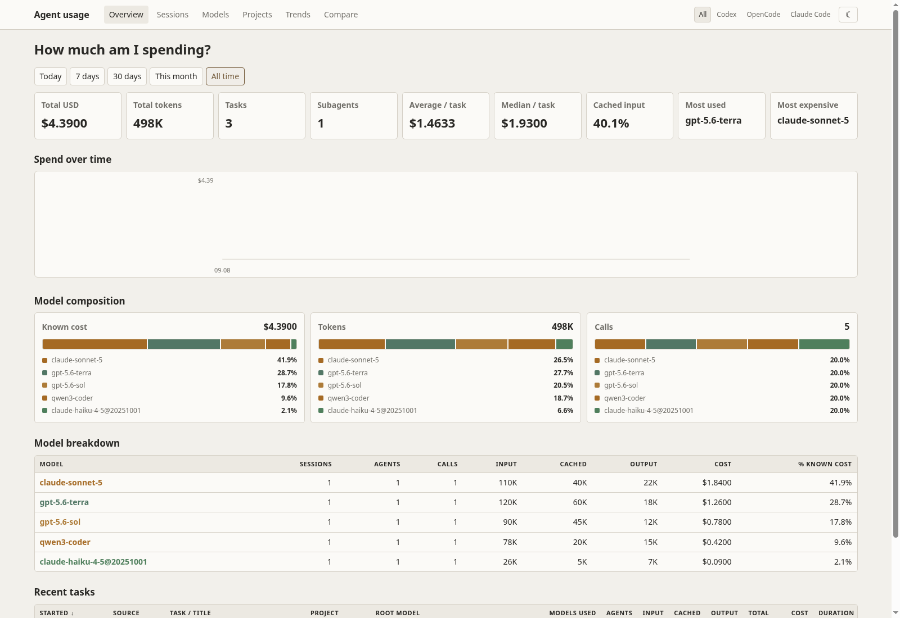
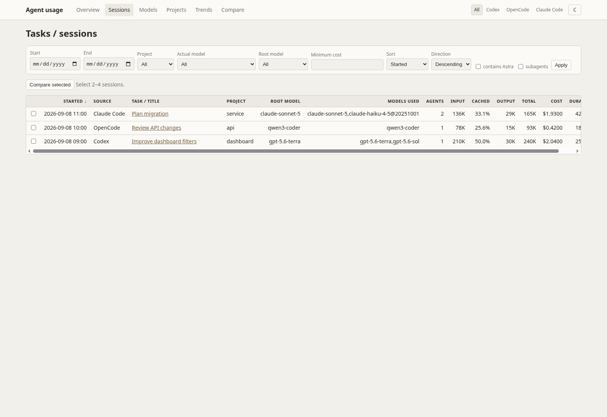
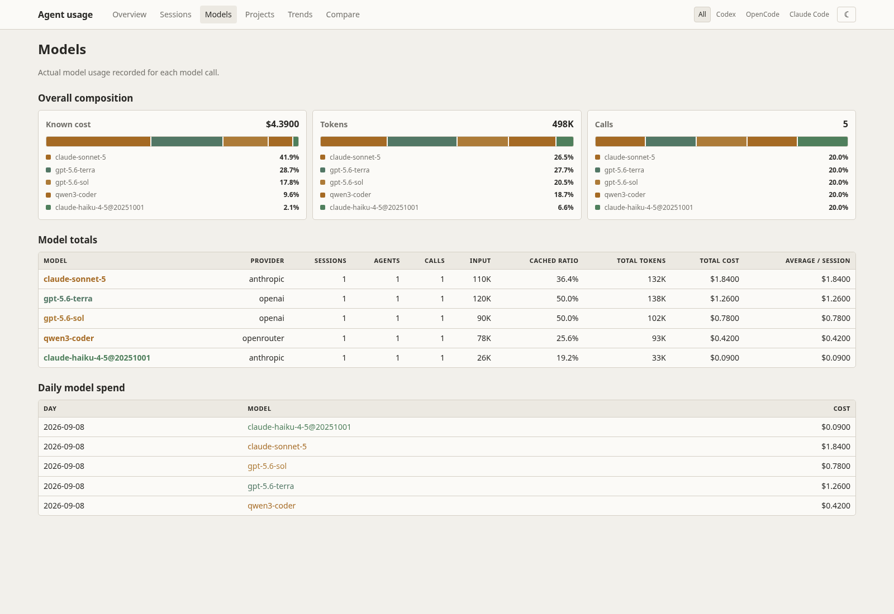

# Coding Agent Usage Dashboard

A local dashboard for token usage, costs, models, projects, and session activity from Codex, OpenCode, and Claude Code.



## What you can see

- Spend, token, and call trends
- Model composition and cache usage
- Sessions, subagents, projects, and source-specific reports
- CSV and JSON exports
- Light and dark themes

The dashboard reads local history and stores its own reporting database. It does not send source data to an external service.

## Install

Requires Python 3.11 or newer and at least one supported coding agent with local history.

### With uv

```bash
uv sync
uv run codex-dashboard ingest --all
uv run codex-dashboard serve
```

### With pip

```bash
python -m venv .venv
source .venv/bin/activate
python -m pip install -r requirements.txt
python -m pip install .
codex-dashboard ingest --all
codex-dashboard serve
```

Open <http://127.0.0.1:8765>.

## Use

Start the dashboard with `codex-dashboard serve`. If you installed with uv, use `uv run codex-dashboard serve`. It checks configured sources for updates while it runs. Use `codex-dashboard doctor` to see which sources it found and why a source may show no data.

Choose **All sources**, **Codex**, **OpenCode**, or **Claude Code** from the dashboard filter. The Sessions view lets you inspect individual sessions; Models and Projects show aggregate usage. Use the theme switcher to choose light or dark mode.

To use a non-default history location, set the matching environment variable before running a command:

```bash
CODEX_HOME=~/.codex_private uv run codex-dashboard serve
OPENCODE_DB=/path/to/opencode.db uv run codex-dashboard serve
CLAUDE_CONFIG_DIR=/path/to/claude uv run codex-dashboard serve
```

If you installed with pip, omit `uv run` from these commands.





## License

Licensed under the [Apache License 2.0](LICENSE).
